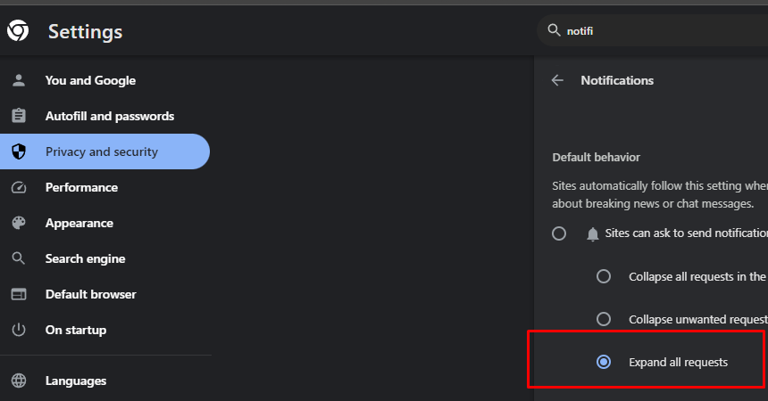
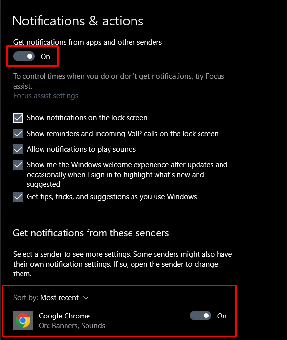
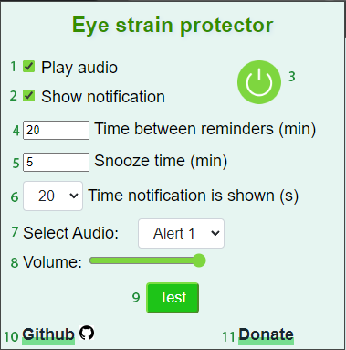
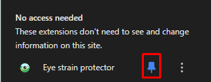

# Eye Strain Protector

Welcome to Eye Strain Protector! 

Rest your eyes with helpful reminders from notifications and sound alerts, fully customizable!

If you like the extension, please give it a star on GitHub! 

## Support Our Efforts

You can support our efforts to keep the internet free with a donation!

### Support Our Work

Donations help me make tools like this for free in my spare time. Any amount helps! ❤️

## Enabling Notifications

For notifications to work, you must enable them on your browser AND on your system.

## How to Use the Extension

1. Play audio for every rest reminder (chosen on 7)
2. Show notification for every rest reminder
3. Turn extension off / on
4. Set the interval (in minutes) for rest reminders
5. Set snooze duration (in minutes)
6. Set notification duration (in seconds)
7. Select audio file to be played
8. Set volume for audio file
9. Test audio and notification
10. [GitHub page for extension](https://github.com/spin311/EyeStrainProtector)
11. [Donate with PayPal or any credit card](https://www.paypal.com/donate/?hosted_button_id=4WXEWMN3QGLGY)

Make sure to pin the extension

## Contact

If you have any suggestions or questions, you can contact me at [spin311pro@gmail.com](mailto:spin311pro@gmail.com).

Enjoy 😊